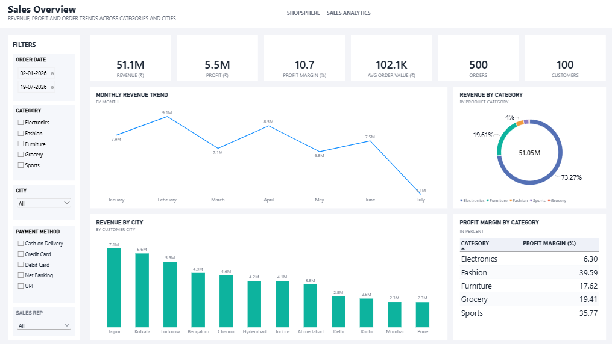
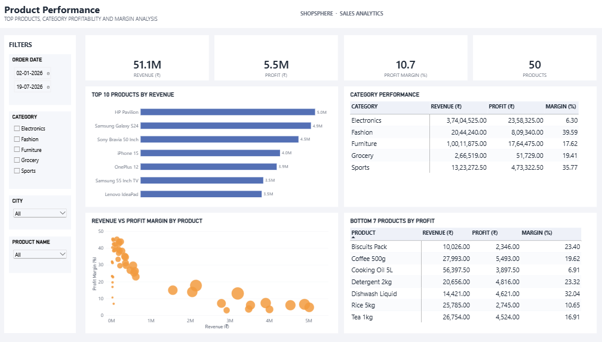
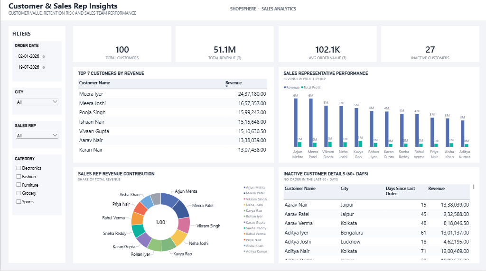

# ShopSphere Sales Analytics

A business-focused Sales Analytics project built using **MySQL, Power BI, DAX, Power Query, and Data Analysis** to transform sales data into actionable business insights.

## Project Overview

ShopSphere Sales Analytics analyzes sales, product, customer, and sales representative performance to answer practical business questions around revenue, profitability, customer behavior, and sales performance.

The project combines **SQL-based business analysis** with an interactive **Power BI dashboard**.

## Business Objectives

- Analyze overall sales and profitability
- Identify top-performing products and categories
- Understand customer purchasing behavior
- Evaluate sales representative performance
- Identify high-value and inactive customers
- Track revenue trends and contribution
- Support data-driven business decisions

## Key Metrics

| Metric | Value |
|---|---:|
| Revenue | ₹51.1M |
| Profit | ₹5.5M |
| Profit Margin | 10.7% |
| Average Order Value | ₹102.1K |
| Orders | 500 |
| Customers | 100 |
| Products | 50 |
| Inactive Customers | 27 |

## SQL Analysis

The project includes **45 business-focused SQL queries** covering:

- Data exploration
- Aggregations and business KPIs
- GROUP BY and HAVING
- Joins
- Subqueries and correlated subqueries
- Common Table Expressions (CTEs)
- Revenue and profit analysis
- Customer and product analysis
- City-wise sales analysis
- Sales representative performance
- Ranking with `RANK`, `DENSE_RANK`, and `ROW_NUMBER`
- `PARTITION BY`
- Month-over-month analysis using `LAG`
- Cumulative revenue
- Revenue contribution
- Top 20% customer analysis
- Customer inactivity analysis

## Power BI Dashboard

The Power BI dashboard is organized into three analytical views:

### 1. Sales Overview
Provides a high-level view of revenue, profit, orders, AOV, and overall sales trends.



### 2. Product Performance
Analyzes product and category performance to identify high-revenue and high-profit products.



### 3. Customer & Sales Representative Insights
Provides insights into customer behavior, customer value, inactivity, and sales representative performance.



## Tools & Technologies

- **SQL:** MySQL
- **BI:** Power BI
- **Data Transformation:** Power Query
- **Calculations:** DAX
- **Data Analysis:** Business-focused SQL analysis
- **Version Control:** Git & GitHub

## Project Workflow

```text
Raw Data
   ↓
Data Preparation & Transformation
   ↓
MySQL Analysis
   ↓
Business Questions & SQL Insights
   ↓
Power BI Data Modeling
   ↓
DAX Measures
   ↓
Interactive Dashboard
   ↓
Business Insights


## Key Business Questions

This project answers questions such as:

- What are the total revenue and profit generated?
- Which products and categories generate the highest revenue?
- Which products generate the highest profit?
- Which customers contribute the most revenue?
- Which customers are inactive?
- Which cities generate the most sales?
- Which sales representatives perform above average?
- How is revenue changing month over month?
- What percentage of total revenue comes from each category?
- Which products have high revenue but low profit margins?
- Which customers fall within the top 20% by revenue?

## Outcome

The project demonstrates the complete workflow of a Data Analyst:

**SQL Analysis → Data Transformation → Data Modeling → DAX → Dashboard Development → Business Insights**

It focuses not only on building visuals, but also on answering meaningful business questions using data.
